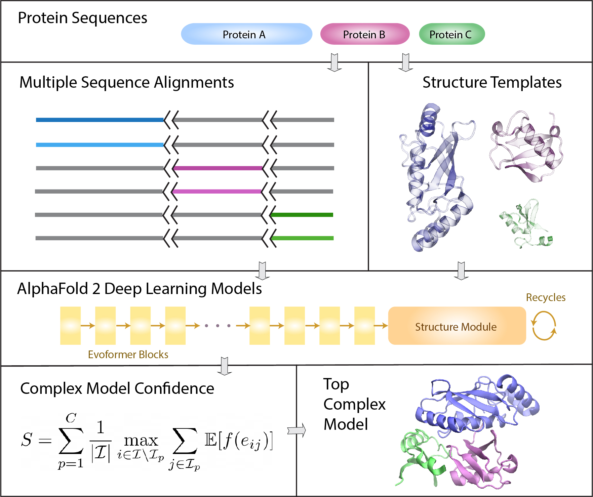

# AF2Complex
## Predicting direct protein-protein interactions with deep learning

This is an extension of [AlphaFold 2](https://github.com/deepmind/alphafold) generalized for 
predicting structural models of a protein complex. It is based on AlphaFold [version v2.0.1](https://github.com/deepmind/alphafold/releases/tag/v2.0.1) 
released by DeepMind in July 2021. We added a few features useful for modeling protein complexes 
that are not explicitly intended for but hidden in AF2's original release.



## Features

- Predicting structural models of a protein complex, e.g., a homooligomer or heterooligomer.
- Paired MSAs are not required for complex modeling
- New metrics for evaluating structural models of protein-protein interfaces
- Option to save the intermediate models during recycles
- Added `genome`, `super`, `economy` presets
- Modularized workflow including data pipeline (stage 1), DL model 
inference (stage 2a) and MD minimization (stage 2b).

## Installation

If you have installed AlphaFold [version v2.0.1](https://github.com/deepmind/alphafold/releases/tag/v2.0.1), 
no additional package is required. If not, please follow its official installation guide of 
[AlphaFold 2](https://github.com/deepmind/alphafold) first. This package requires the deep learning 
models with the capability of TM-score prediction (pTM). Please note that DeepMind's latest 
DL models re-trained for AlphaFold-multimer have not been tested and are not required.

After you have set up AlphaFold 2, please clone this repository and follow the guide for examples
below.

## Example

Under the "example" directory, there are two CASP14 assembly targets as the examples. 
The goal is to predict the complex structures for these two targets,
one heterodimer (A1:B1) and one heterotetramer (A2:B2). The input features have been
generated for the individual protein sequences of these targets and placed under the
subdirectory `af_fea`. We use these input features of single chains to predict the 
structures of their complexes forms. Note that the input features were generated using 
databases released before the start date of CASP14.

Use `run_af_stage2a_comp.sh` shell script to run the examples. Be sure to modify it 
such that that the correct conda environment for AlphaFold is loaded and the correct 
path to the model parameters of AlphaFold 2 is pointed to.

```sh
./run_af_stage2a_comp.sh
```

The output structural models are under the diretory `af_mod`. For the purpose of comparison, 
the experimental structures of these two examples are under directory `ground_truth`.

## Input feature generation
If you apply this package to a new target. The first step is to generate input features for
each individual (unique) protein sequences of your target using AF2's data pipeline. For
convenience, we split the original AF2 workflow and provide a script ```run_af_stage1.py```
for this purpose. This script will generate input for individual protein sequences, which 
you may use to predict either a single chain (monomer) or multi-chain (complex) structures.
You may skip this step if you already have `features.pkl` files generated for your target.

## Complex structure prediction
After you collected the features of individual protein sequences. You may use them to
predict a complex structure made of these sequences, using the script ```run_af_stage2a_comp.py```.
The stoichiometry of your target, be it a monomer or a complex, is defined in an input list 
file. In the example above, the file is `test.lst`. The general format of this file is 

`A:2/B:2/C/D/D total_length target_name`

where the first column is the stoichiometry of the complex, using the names of the individual
sequences, total_length is the total number of amino acids of the putative complex, and
target_name is optional for naming the output subdirectory purpose. During a prediction,
the program will look for input features of A, B, C, D under the input feature directory
you supplied to the program. If you provide only one protein name, it reverts to a regular
AF2 run.

## Model relaxation
Optionally, you may run the MD minimization to eliminate some clashes in the unrelaxed
models obtained above, by running the script ```run_af_stage2b.py```.

## Output files
- `model_[1-5]_ptm_*.pdb`  Output structural (unreleaxed) models in the PDB format. 
   If there are mutliple chains, they are named alphabetically starting from 'A'
- `model_[1-5]_ptm_*.pkl`  Pickle file contains extra prediction from the DL model
- `ranking_all.json` or `model_*.json` Information about the model, such as predicted scores.
  By default, if it is complex prediction, the models are ranked by the interface-score.
  For single chain, it is ranked by predicted TM-score.
- `features.pkl` This is a pickle file conatining features for structure prediction (stage 2a).
  It is the output from the data pipeline by running the stage 1 script. 
- `relaxed_model_*.pdb` Relaxed structural models by running the stage 2b script.
- If you choose to save intermediate pdb files from recycling, the files will be under
 a subdirectory named `recycled`.


## Reference
- Predicting direct physical interactions in multimeric proteins with deep learning.
Mu Gao, Davi Nakajima An, Jerry M. Parks, and Jeffrey Skolnick. (2021)

- Highly accurate protein structure prediction with AlphaFold.
Jumper, J. et al., Nature 596, 583-589  (2021).

- ColabFold - Making protein folding accessible to all. Mirdita, M., Ovchinnikov, S. & Steinegger, M, bioRxiv, 2021.2008.2015.456425  (2021).

## Data sets
Data sets and predicted structural models described in the AF2Complex reference are 
available at [the CSSB website at Georgia Tech](https://sites.gatech.edu/cssb/af2complex/).

## Licencse

The source code is licensed under the Apache License, Version 2.0 (the "License"); you may not use this file except in compliance with the License. You may obtain a copy of [the License](https://www.apache.org/licenses/LICENSE-2.0).

Unless required by applicable law or agreed to in writing, software distributed under the License is distributed on an "AS IS" BASIS, WITHOUT WARRANTIES OR CONDITIONS OF ANY KIND, either express or implied. See the License for the specific language governing permissions and limitations under the License.

Please follow the [license agreement](https://github.com/deepmind/alphafold#model-parameters-license) by DeepMind for using their neural network models of AlphaFold 2.
