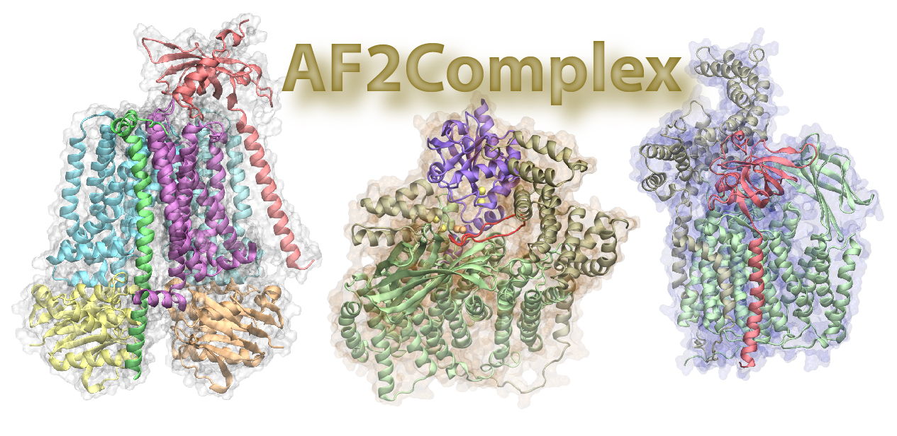

## Predicting and modeling protein complexes with deep learning
Accurate descriptions of protein-protein interactions are essential for understanding biological systems. Can we predict protein-protein interactions given an arbitrary pair of protein sequences, and more generally, can we identify higher order protein complexes among an arbitrary number of protein sequences? AF2Complex was born to address this question by taking advantage of [AlphaFold](https://github.com/deepmind/alphafold), sophisticated neural network models originally designed for predicting structural models of single protein sequences by DeepMind. We extended it not only to model known protein-protein interactions, but also to predict possible interactions among multiple proteins by using the confidence of the predicted structural models. The approach can be applied to challenging scenarios such as transient interactions of membrane proteins that are difficult to capture experimentally.

In a nutshell, AF2Complex is an enhanced version of AlphaFold with many features useful for real-world scenarios involving protein complexes. Its initial development is based on AlphaFold [version v2.0.1](https://github.com/deepmind/alphafold/releases/tag/v2.0.1),
released by DeepMind in July 2021. After DeepMind released AlphaFold-Multimer [version v2.1.1](https://github.com/deepmind/alphafold/releases/tag/v2.1.1) in November 2021, AF2Complex has been updated to support the multimer models released later on. Details of our initial development, including large-scale  performance evaluations and exemplary applications, have been described in [this publication](https://www.nature.com/articles/s41467-022-29394-2).

In [a recent work](https://elifesciences.org/articles/82885), we further demonstrate how to use AF2complex to conduct a large-scale virutal screening to discover novel protein-protein interactions. Using *E. coli* envelopome (all proteins within the cell envelope) as the screening library, AF2Complex was applied to proteins from the outer membrane biogenesis pathway. Unexpected protein-protein interactions with profound implication were revealed.

You may test examples of AF2Complex or explore protein-protein interactions within the *E. coli* proteome in Google Cloud using **[this colab notebook](https://colab.research.google.com/github/FreshAirTonight/af2complex/blob/main/notebook/AF2Complex_notebook.ipynb)**.


## Updates and Features

#### Version 1.4.0 (2023-01-30)

- Support AF-Multimer v3 multimer models (based on [AF v2.3.1](https://github.com/deepmind/alphafold/releases/tag/v2.3.1))
- More options for input feature generation

#### Version 1.3.0 (2022-08-30)

- Google Colab notebook access
- Added multiple MSA pairing options
- Enhanced interface score assessment
- Clustering predicted complexes

#### Version 1.2.2 (2022-03-10)

- Minor bug fix
- Support AF-Multimer v2 neural network models (AF v2.2.0)

#### Version 1.2.0 (2022-02-19)

- Added support to AF-Multimer neural network models (AF v2.1.0) in both paired and unpaired MSAs modes
- Domain cropping pre-generated full monomer features (in unpaired MSAs mode only)
- Checkpoint option for model inference
- Refactored code

#### Version 1.0.0 (2021-11-09)

- Predicting structural models of a protein complex
- Paired MSAs not required for complex modeling
- Metrics for evaluating structural models of protein-protein interfaces
- Option to save the intermediate models during recycles
- Added `genome`, `super`, `economy` presets
- Modularized workflow including feature generation, DL model inference and MD minimization

## Installation

This package has essentially the same software dependency and hardware requirement as AlphaFold
[version v2.3.1](https://github.com/deepmind/alphafold/releases/tag/v2.3.1).
If you have installed it, only this package and an additional python module (`networkx`) is required. If you have not installed AF2, please follow its official installation guide of [AlphaFold 2](https://github.com/deepmind/alphafold) first. Note that if you just want to evaluate [the examples](./example/README.md) we provided, you do *not* need to install any sequence library or third-party sequence searching tools as the input features of the examples have been prepared for you. After resolving all python dependency required, you are (almost) good to go.

The other items you need are the [AlphaFold deep neural network models](https://storage.googleapis.com/alphafold/alphafold_params_2022-12-06.tar) trained by DeepMind. Running this package requires the DL models with the TM-score prediction capability (i.e, monomer_ptm or multimer models). In AF's releases, these models are named as `params_model_x_ptm.npz` (AF version 2.0.x), `params_model_x_multimer.npz` (AF version 2.1.x), or `params_model_x_multimer_v2.npz` (AF version 2.2.x), or `params_model_x_multimer_v3.npz` (AF version 2.3.x). The examples we provided uses the original `monomer_ptm` and the most recent `multimer_v3` models, but you could use other version of multimer models as well. The installation of AlphaFold computing environment could take hours, dependent on whether you choose to do a full installation that includes all sequence libraries. Downloading these sequence and PDB template libraries are time-consuming.

After you have set up AlphaFold 2, simply clone this repository by
```sh
git clone https://github.com/FreshAirTonight/af2complex
```
 and follow the guide to run the demo examples.

## Examples

Under the "example" directory, there are three CASP14 multimeric targets, H1065, H1072, and H1060v4. The goal is to predict the structures for these target complexes, one heterodimer (A1:B1), one heterotetramer (A2:B2), and another challenging homo-dodecamer (A12). For your convenience, the input features to deep learning models are provided so that you can perform the structure prediction directly. Please follow [a detailed instruction](./example/README.md) on how to test these examples.

## Feature generation
We provide the pre-generated features for our benchmark data sets, and for the *E. coli* proteome (~4,400 proteins) at [Zenodo](https://doi.org/10.5281/zenodo.6084186). For AF2Complex v1.3.0 and above, a new set of input features for *E. coli* have been generated so that one can use multiple MSA pairing mode. We recommend that you check out [this new feature library](https://doi.org/10.5281/zenodo.7008599).

If you apply this package to a new target. The first step is to generate input features. For the purpose of efficient computing, we have created a staged AF2 workflow and provide a script `run_af2c_fea.py` for the stage of feature generation. This script will output features (in python pickle format) for an individual protein sequence. Multiple options for feature generation are provided, including both the original monomer data pipeline and modified pipelines that add species information for MSA pairing later, and search the full PDB library for templates. These input features of individual monomers are then used in the next, model inference stage. For a complex target, AF2Complex assembles its monomeric components for model prediction. In this way, the input features of monomers can be re-used for predicting many combinations of protein-protein interations. Please check out [this guide](./example/README.md#Generating-input-features) for options and an example run script ```run_fea_gen.sh```.

AF2Complex version 1.3.0 and above supports reading regular or gzipped feature pickle files directly. This reduces the storage requirement for high-throughput PPI virtual screening.

## Target syntax

After collecting the input features of monomers, you may predict a complex structure using the script ```run_af2c_mod.py```, which runs through deep learning model inference. The stoichiometry of your target, be it a monomer or a complex, is defined in an input list file. In the examples we provided, the target list files are under subdirectory `targets`. The general format of one target is defined like the follows,

`A:2/B:2/C/D/E <total_length> <target_name>`

where the first column defines the stoichiometry of the complex, e.g., `A:2/B:2/C/D/E`, using the IDs of the individual sequences, `:<num>` after each protein defines its homo copy number, and `/` to separate distinct monomers. The IDs of monomers are also used as the name of sub-directory for locating their input features.  The second column, `<total_length>`, is the total number of amino acids of the putative complex. The length is parsed but not used by the model inference python script, it is intended for a job scheduler during batch job submission on a computing cluster. The third column, `<target_name>`, is the name of the output sub-directory for predicted structural models.

In the example above, the target complex is made of five protein sequences named A to E, and protein A and B each have two copies. During a prediction, the program will look for individual input features of A to E under the input feature directory, e.g, `$input_dir/A/features.pkl(.gz)`, and then assemble them into the features for complex structure prediction. If you provide only a single protein without a copy number, e.g., `A <seq_length>`, it reverts to a structural prediction of a single protein A.

A more advanced example that restricts modeling to certain domains within a sequence is like the follows

`A|19-200;500-700:2/B/C 1788 A2BC`

where the residue ranges, 19 to 200 and 500 to 700, are taken out from A's full length input features for modeling A2BC, composed of two copies of A, single copy of B and C, and with a total size of 1788 AAs. The domain modeling capability allows conveniently modeling parts of a large sequence, and also avoid possible errors caused by using a partial sequence to derive MSAs.

A new symbol `+` is introduced in version 1.3.0. This plus sign separates individual chains like a slash `/`, but marks entities (can be made of multiple chains) between which the interface score will be calculated. For example, in A:2/B:2/C/D, the interface score (iScore) will be calculated on the full target. If there is a complex formed, e.g., A:2/B:2, it will give a high iScore regardless whether C or D interacts with A2:B2 or not. The plus sign is introduced such that one can evaluate iScore on specified combinations of chains. If we changed the target format to A:2/B:2+C/D, the iScore will be calculate only for interface between A2:/B:2 and C/D, as it treats A2:/B2 and C/D as two super entities. Please checkout [Example 3](./example/README.md#Example-3) and [a script for interface score calculation](./example/README.md#Interface-score-calculation).

## MSA pairing mode
In version 1.3 and above, we have introduced multiple choices for pairing MSAs of individual monomers of a target. With the exception of the unpaired mode, all other pairing modes requires species information of sequences in the MSA alignments. Such information is added via a modified data pipeline as explained [here](./example/README.md#Generating-input-features). The MSA pairing options are available when you choose either `monomer_ptm` or `multimer_np` as the model preset, and the options are:

- `None` No MSA pairing, the default option
- `all` Pairing every monomers in a target as many as possible, this follow the same pairing mechanism as used by AlphaFold
- `cyclic` Pairing the immediate neighbor monomers in your target like in a ring topology. This is useful for predicting ring structures which is quite commone. See [Example 4](./example/README.md#Example-4).
- `linear` Similar to `cyclic` but without pairing the first and the last monomer
- `custom` Arbitrary pairing, which may be useful for building very large complexes. This is a an experimental feature. You need to define an adjacency matrix as shown in [this example file](./example/H1072.adj).


## Checkpoint

To help tackle a large target on a limited computing resource, AF2Complex provides a checkpoint option in the model inference stage. An example usage is included in [this example](./example/README.md#A-general-model-inference-script). Note that the checkpoint is saved at the end of the all recycles done (due to a limitation imposed by JAX). Therefore, to use this feature, one has to estimate beforehand how many recycles will be done before saving a checkpoint. Additionally, for a large target, it is recommended to turn off intermediate recycle output (by setting `save_recycled=0`) to save memory cost, and to use multiple short runs with the checkpoint option to get the intermediate recycle structures, e.g., every two, or three recycles.

## Model relaxation

Optionally, you may run a MD minimization to reduce atomic clashes in "un-relaxed" models generated above to obtain "relaxed" models. The script for this purpose is ```run_af2c_min.py```. And [a demo script](./example/README.md#Model-relaxation) is provided under the `example` directory.

## Output files

- `model_[1-5]_ptm_*.pdb` and `model_[1-5]_multimer_v3_*.pdb`  Output structural (unreleaxed) models in the PDB format. The naming scheme is DL model followed by the number of runs (p1, p2 ...), date, and the six digit random seed employed. If there are multiple chains in a PDB file, they are named alphabetically starting from 'A'.
- `model_[1-5]_ptm_*.pkl` and `model_[1-5]_multimer_v3_*.pkl` Pickle file contains extra information from the DL model.
- `ranking_all.json` or `model_*.json` Information about the model, such as predicted scores.By default, if there are multiple complex model predictions, the models are ranked bytheir interface-scores. For single chain models or multipel chain models without interaction, they are ranked by predicted TM-score.
- `features.pkl` This is a pickle file containing features generated from the data pipeline by running the `run_af2c_fea` script. It is employed for structure prediction during DL model inference.
- `relaxed_model_*.pdb` Relaxed structural models by running the `run_af2c_min` script.
- If you choose to save intermediate PDB files from recycling, the files will be under a subdirectory named `recycled`.
- If you choose to use checkpoint, a checkpoint will be under a subdirectory named `checkpoint`, in which a python pickle file named by `model_*_[checkpoint_tag].pkl` is saved for reloading in a future run.

## Reference

- AF2Complex predicts direct physical interactions in multimeric proteins with deep learning. Mu Gao, Davi Nakajima An, Jerry M. Parks, and Jeffrey Skolnick.
[Nature Communications **13**:1744](https://www.nature.com/articles/s41467-022-29394-2) (2022).

- Deep learning-driven insights into super protein complexes for outer membrane protein biogenesis in bacteria.  Mu Gao, Davi Nakajima An, and Jeffrey Skolnick. [eLife, **11**: e82885](https://elifesciences.org/articles/82885) (2022).

- Proteome-scale deployment of protein structure prediction workflows on the Summit supercomputer. Mu Gao, Mark Coletti, et.al., HiCOMB 2022, [arXiv, 2201.10024](https://arxiv.org/abs/2201.10024) (2022).

- Highly accurate protein structure prediction with AlphaFold. Jumper, J. et al., Nature **596**:583-589  (2021).

- Protein complex prediction with AlphaFold-Multimer. Evans, R., et al., bioRxiv, 2021.10.04.463034 (2021).

- ColabFold - Making protein folding accessible to all. Mirdita, M., et.al., bioRxiv, 2021.2008.2015.456425  (2021).

## Data sets and pre-generated input features

Benchmark data sets used for benchmarking AF2Complex and the top computational models of *E. coli* Ccm system I are available at [Zenodo](https://doi.org/10.5281/zenodo.6084186).

Pre-generated input features of the full *E. coli* proteome are also provided [here](https://doi.org/10.5281/zenodo.6970367). You are welcome to use these features to predict the interactions among any *E. coli* proteins of your choice, or the whole interactome! If you use the data set and code, please cite [our work](https://www.nature.com/articles/s41467-022-29394-2).

## Acknowledgment

We thank all scientists who did decades of hard works on protein sequencing and structural modeling. They have laid the groundwork that enables the development of a deep learning approach.

We thank DeepMind for their open-sourced AlphaFold development.

This work was funded in part by the Office of Biological and Environmental Research of the Department of Energy, and the Division of General Medical Sciences of the National Institute Health. The research used resources supported in part by the Director’s Discretion Project at the Oak Ridge Leadership Computing Facility, and the Advanced Scientific Computing Research (ASCR) Leadership Computing Challenge (ALCC) program. We are grateful to access the computing resources provided by the Leadership Computing Facility at Oak Ridge, National Energy Research Scientific Computing Center at Berkeley, and the Partnership for an Advanced Computing Environment (PACE) at the Georgia Institute of Technology.

## License

The source code is licensed under the Apache License, Version 2.0 (the "License"); you may not use this file except in compliance with the License. You may obtain a copy of [the License](https://www.apache.org/licenses/LICENSE-2.0).

Unless required by applicable law or agreed to in writing, software distributed under the License is distributed on an "AS IS" BASIS, WITHOUT WARRANTIES OR CONDITIONS OF ANY KIND, either express or implied. See the License for the specific language governing permissions and limitations under the License.

Please follow the [license agreement](https://github.com/deepmind/alphafold#model-parameters-license) by DeepMind for using their neural network models of AlphaFold.
